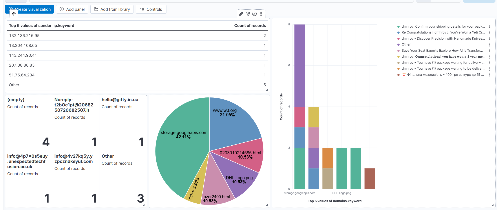
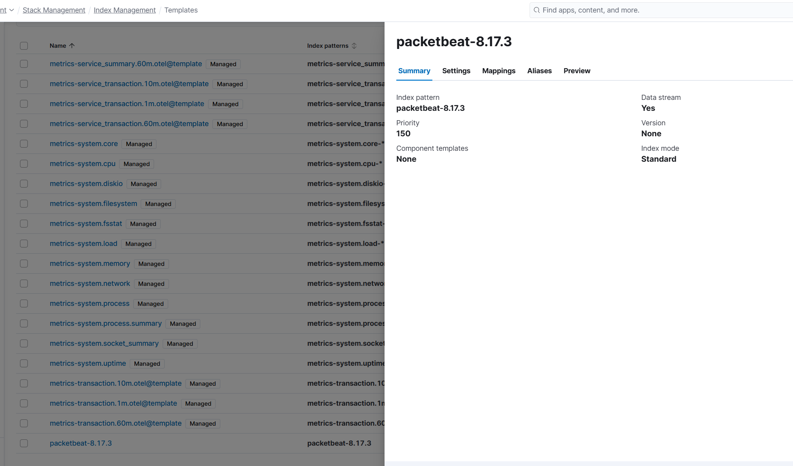
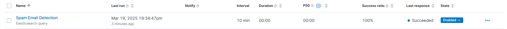
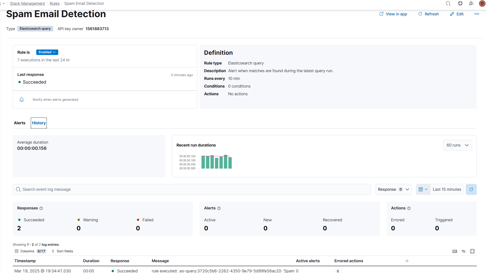

### Step 1: Download spam emails from Gmail
### Step 2: Create a Python script to extract IOCs

``` bash
mkdir email
vim email_ioc.py
```
[email_ioc.py](email_ioc.py)

### Step 3: Install required Python packages and create a directory for email files

``` bash
pip install elasticsearch python-dateutil
mkdir spam_emails
cd spam_emails
```
Add downloaded .eml files in this directory.

### Step 4: Set up Elastic Cloud trial account
- Create a deployment with default settings
- Save your Elastic Cloud ID, username, and password

### Step 5: Run the script to extract IOCs and send to Elastic

``` bash
python email_ioc.py --email-dir ./spam_emails --es-cloud-id CLOUD_ID --es-username elastic --es-password PASSWORD
```
output
``` bash
Processing ./spam_emails/dmhrov, Confirm your shipping details for your package - 'DHL' (wFvhtIEb@rbKysHu.us) - 2025-03-08 1605.eml...
Document indexed with ID: tHBen5UB25SujnWOJJwm
Processing ./spam_emails/dmhrov - You have (1) package waiting to be delivered 📦. Use your code to track and receive it. ID#7587 - ' 'DHL®' ' (info@4v27kq5y.yzpczndkeyuf.com) - 2025-02-18 0450.eml...
Document indexed with ID: tXBen5UB25SujnWOJpy7
Processing ./spam_emails/dmhrov - You have (1) package waiting to be delivered 📦. Use your code to track and receive it.ID#7707 - ' 'DHL®' ' (info@p4o5i6u8y3t1r9e2eu.eu) - 2025-03-05 1603.eml...
Document indexed with ID: tnBen5UB25SujnWOKZxU
Processing ./spam_emails/dmhrov -  Discover Precision with Handmade Knives - ' 'Huusk®' ' (info@innovativebranddesign.nl) - 2025-02-17 1708.eml...
Document indexed with ID: t3Ben5UB25SujnWOK5z0
Processing ./spam_emails/dmhrov - You have (1) package waiting for delivery 📦. Use your code to track and receive it. ,ID#0213 - ' 'DPD®' ' (info@4p7x0s5euy.unexpectedtechfusion.co.uk) - 2025-03-04 1217.eml...
Document indexed with ID: uHBen5UB25SujnWOMpyM
Processing ./spam_emails/⏰ Фінальна можливість – 400 грн за курс до 15 березня! - Campster (office@thecampster.com) - 2025-03-11 0454.eml...
Document indexed with ID: uXBen5UB25SujnWONJz6
Processing ./spam_emails/dmhrov, 𝐂𝐨𝐧𝐠𝐫𝐚𝐭𝐮𝐥𝐚𝐭𝐢𝐨𝐧𝐬! 𝐲𝐨𝐮 𝐡𝐚𝐯𝐞 𝐰𝐨𝐧 𝐚 𝟏 𝐲𝐞𝐚𝐫 𝐦𝐞𝐦𝐛𝐞𝐫𝐬𝐡𝐢𝐩 - ''𝐓𝐄𝐒𝐂𝐎''(mtzasSCY@xVwuH.com) - 2025-02-22 0126.eml...
Document indexed with ID: unBen5UB25SujnWOO5y7
Processing ./spam_emails/Save Your Seat  Experts Explore How AI Is Transforming Reliability - FireHydrant (marketing@firehydrant.com) - 2025-03-05 2133.eml...
Document indexed with ID: u3Ben5UB25SujnWOPpxT
Processing ./spam_emails/Подарунки для себе та рідних🎁 Зігріваймося у морозну погоду❄ - Gifty (hello@gifty.in.ua) - 2025-02-18 1703.eml...
Document indexed with ID: vHBen5UB25SujnWOQJzW
Processing ./spam_emails/Re  Congratulations [ dmhrov ]! You've Won a Yeti Crossroads Backpack - ''Mountain Warehouse Team''(Noreply-t2bOc1pt@2068250720682507.it) - 2025-03-16 1517.eml...
Document indexed with ID: vXBen5UB25SujnWOQ5x4
Extracted IOCs from 10 emails and saved to iocs.json
```

[iocs.json](iocs.json)


### Step 6: Create visualizations in Kibana



### Step 7: Install Elastic Agent on laptop

go to **Fleet** -> Click **Add Agent** -> create a new one - spm-email 

``` bash
curl -L -O https://artifacts.elastic.co/downloads/beats/elastic-agent/elastic-agent-8.17.3-linux-x86_64.tar.gz
tar xzvf elastic-agent-8.17.3-linux-x86_64.tar.gz
cd elastic-agent-8.17.3-linux-x86_64

sudo ./elastic-agent install --url=https://3474d9fcb1c34390084v6199119a66a0e48.fleet.us-east-2.aws.elastic-cloud.com:443 --enrollment-token=ektoken41tokenzVwd0E6cWVjOWtokenbFdtokenJKUjtoken==
```

output
``` bash
Elastic Agent will be installed at /opt/Elastic/Agent and will run as a service. Do you want to continue? [Y/n]:y
[  ==] Service Started  [43s] Elastic Agent successfully installed, starting enrollment.
[====] Waiting For Enroll...  [44s] {"log.level":"info","@timestamp":"2025-03-16T17:45:18.876+0200","log.origin":{"function":"github.com/elastic/elastic-agent/internal/pkg/agent/cmd.(*enrollCmd).enrollWithBackoff","file.name":"cmd/enroll_cmd.go","file.line":520},"message":"Starting enrollment to URL: https://3474dddgr3453b1c3477j3d586196uyi6656a0e48.fleet.us-east-2.aws.elastic-cloud.com:443/","ecs.version":"1.6.0"}
[==  ] Waiting For Enroll...  [46s] {"log.level":"info","@timestamp":"2025-03-16T17:45:20.714+0200","log.origin":{"function":"github.com/elastic/elastic-agent/internal/pkg/agent/cmd.(*enrollCmd).daemonReloadWithBackoff","file.name":"cmd/enroll_cmd.go","file.line":483},"message":"Restarting agent daemon, attempt 0","ecs.version":"1.6.0"}
{"log.level":"info","@timestamp":"2025-03-16T17:45:20.716+0200","log.origin":{"function":"github.com/elastic/elastic-agent/internal/pkg/agent/cmd.(*enrollCmd).Execute","file.name":"cmd/enroll_cmd.go","file.line":301},"message":"Successfully triggered restart on running Elastic Agent.","ecs.version":"1.6.0"}
Successfully enrolled the Elastic Agent.
[=   ] Done  [46s]
Elastic Agent has been successfully installed.
```

### Step 8 Install packetbeat and configure
``` bash
sudo apt update
sudo apt install packetbeat
```
##### Add username, password and host to /etc/packetbeat/packetbeat.yml
``` yaml
output.elasticsearch:
  # Array of hosts to connect to.
  #hosts: ["localhost:9200"]
  hosts: ["https://64csaf01a76666eggdgaad99a7253b.us-east-2.aws.elastic-cloud.com:443"]
  username: "elastic"
  password: "O2pCx7HregergewerIzxKwy"
``` 
##### Test:
``` bash
sudo packetbeat test config -c /etc/packetbeat/packetbeat.yml
Config OK
```

``` bash
sudo packetbeat test output
elasticsearch: https://64cfgrg1a701b419theherh345sfsdf48bfb3aad99a7253b.us-east-2.aws.elastic-cloud.com:443...
  parse url... OK
  connection...
    parse host... OK
    dns lookup... OK
    addresses: 3.20.15.202, 3.133.83.227, 18.224.99.228
    dial up... OK
  TLS...
    security: server's certificate chain verification is enabled
    handshake... OK
    TLS version: TLSv1.3
    dial up... OK
  talk to server... OK
  version: 8.17.3
  ```
##### Restart packetbeat
```bash
sudo systemctl restart packetbeat
```
##### Index checking


### Step 9 Create a new rule


Rule name - Spam Email Detection

event.dataset: "packetbeat.http" AND (http.url: "info@4v27kq5y.yzpczndkeyuf.com" OR http.url: "info@innovativebranddesign.nl" OR http.url: "info@4p7x0s5euy.unexpectedtechfusion.co.uk")

[KQL-Rule](query.json)




